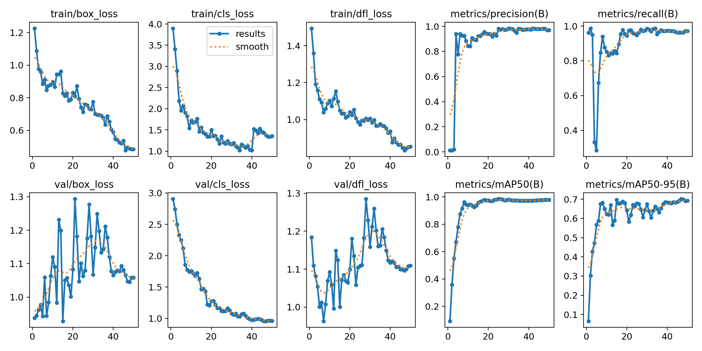

# About the Project
The Smart Traffic Light System project provides an efficient solution for urban traffic management by leveraging the Raspberry Pi Pico microcontroller, USR-E1 Ethernet module, and Yolov5 object detection model. The system is designed to detect and count vehicles (cars and motorbikes) on two roads using two cameras, then automatically adjust the duration of green and red lights based on the traffic density on each road.

Check out our project process on YouTube: [Project Process Video](https://www.youtube.com/watch?v=YDRMhFJVMHo)

    

# PCB Version 1

    

    

# PCB Version 2

    

    

# Project Members
This project was developed by Group 8 from class DHDTVT17D at [Industrial University of Ho Chi Minh City](https://en.wikipedia.org/wiki/Industrial_University_of_Ho_Chi_Minh_City). Our group would like to thank [Dr. Tran Quy Huu](https://www.youtube.com/@huutranstudio5806) (in green shirt) for his enthusiastic supervision.

    

From right to left
    
| Name              | Responsibility                                      |
|-------------------|----------------------------------------------------|
| [Hoàng Long](https://github.com/HoangLong69)    | Team Leader, PCB design, component soldering, interface design, and model training  |
| [Kiều Hoàng My](https://www.facebook.com/profile.php?id=100028766045870) | Model design and preparation for training  |
| [Tạ Quang Khải](https://www.facebook.com/khai.ta.391) | Firmware development and model training  |
| [Phùng Quyền Linh](https://www.facebook.com/profile.php?id=100013088104378) | Image processing implementation  |

# Key Features:
* Real-time vehicle detection: Utilizes the Yolov5 model to identify and count cars and motorbikes.
* Intelligent traffic light timing adjustment: Dynamically changes the duration of green and red lights according to traffic density, reducing congestion.
* Ethernet connectivity: The USR-E1 module ensures stable and efficient data transmission.
* Optimized design: The Raspberry Pi Pico ensures low cost and high performance.

# Control interface:
The system includes a user-friendly control interface developed using **PyQt5**, providing the following features:

- **Connect/Disconnect to IP and Port:** Allows users to establish or terminate connections to the traffic light system via specified IP addresses and ports.
- **Send Timing Commands:** Enables users to set and adjust the timing for each traffic light remotely.
- **Plot Graphs from CSV Files:** Provides visualization tools to generate graphs from CSV files, helping to analyze traffic data effectively.

This interface enhances system usability and provides operators with powerful tools to monitor and manage traffic efficiently.

    

This system not only improves traffic flow but also serves as a research platform for developing more advanced smart traffic solutions in the future.

# Model Training on Local Computer
The YOLOv5 model was trained locally on a high-performance computer with the following specifications:

- **CPU:** Intel Core i7 12700F  
- **RAM:** 32GB  
- **GPU:** NVIDIA RTX 4060 Ti with 16GB VRAM

    

### Training Result:

    

### Training Parameters
The training was conducted using the following parameters: results = model.train(data='custom_dataset.yaml', epochs=50, device=device, batch=16)

# References
- [YOLOv5 GitHub Repository](https://github.com/ultralytics/yolov5)
- [ESP32-Wiznet-W5500-Micropython GitHub Repository](https://github.com/Ayyoubzadeh/ESP32-Wiznet-W5500-Micropython)
- [RP2040 Schematic](https://datasheets.raspberrypi.com/rp2040/hardware-design-with-rp2040.pdf)
- [W5500 Schematic](https://github.com/XYZ-qiyh/W5500_SCH_PCB/blob/main/W5500_SCH_PCB/W5500_SCH.SchDoc)
